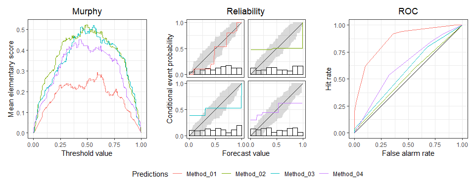
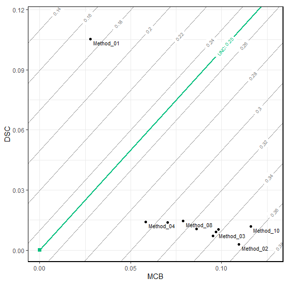

<!-- README.md is generated from README.Rmd. Please edit that file -->

# triptych : Diagnostic Graphics to Evaluate Forecast Performance

<!-- badges: start -->

[](https://lifecycle.r-lib.org/articles/stages.html#experimental)
[](https://CRAN.R-project.org/package=triptych)
<!-- badges: end -->

Overall predictive performance is measured by a mean score (or loss),
which decomposes into miscalibration, discrimination, and uncertainty
components. The main focus is visualization of these distinct and
complementary aspects in joint displays. See Dimitriadis, Gneiting,
Jordan, Vogel (2023)
[arXiv:2301.10803](https://arxiv.org/abs/2301.10803).

## Installation

(Soon) Install the latest release of triptych from CRAN with:

``` r
install.packages("triptych")
```

Install the development version of triptych with:

``` r
# install.packages("devtools")
devtools::install_github("aijordan/triptych")
```

## Example

``` r
library(triptych)

# Predictions and observations
set.seed(20230817)
predictions <- matrix(runif(1000), ncol = 10)
colnames(predictions) <- sprintf("Method_%02i", 1:10)
observations <- rbinom(100, 1, predictions[, 1])

# Construct and inspect
tr <- triptych(predictions, observations)
tr
#> # A tibble: 10 × 5
#>    forecast           murphy     reliability             roc          mcbdsc
#>    <chr>          <trpt_mur>      <trpt_rel>      <trpt_roc>   <trpt_mcbdsc>
#>  1 Method_01 <named list[3]> <named list[3]> <named list[3]> <named list[3]>
#>  2 Method_02 <named list[3]> <named list[3]> <named list[3]> <named list[3]>
#>  3 Method_03 <named list[3]> <named list[3]> <named list[3]> <named list[3]>
#>  4 Method_04 <named list[3]> <named list[3]> <named list[3]> <named list[3]>
#>  5 Method_05 <named list[3]> <named list[3]> <named list[3]> <named list[3]>
#>  6 Method_06 <named list[3]> <named list[3]> <named list[3]> <named list[3]>
#>  7 Method_07 <named list[3]> <named list[3]> <named list[3]> <named list[3]>
#>  8 Method_08 <named list[3]> <named list[3]> <named list[3]> <named list[3]>
#>  9 Method_09 <named list[3]> <named list[3]> <named list[3]> <named list[3]>
#> 10 Method_10 <named list[3]> <named list[3]> <named list[3]> <named list[3]>
class(tr)
#> [1] "triptych"   "tbl_df"     "tbl"        "data.frame"

# 1. Choose 4 predictions
# 2. Add consistency bands (for reliability curves)
# 3. Create patchwork object
# 4. Adjust the title of the legend
dplyr::slice_head(tr, n = 4) |>
  add_consistency(level = 0.9, n_boot = 100) |>
  autoplot() &
  ggplot2::guides(colour = ggplot2::guide_legend("Predictions"))
```



``` r
# From already computed triptych
estimates(tr$mcbdsc)
#> # A tibble: 10 × 5
#>    forecast  mean_score    MCB     DSC   UNC
#>    <chr>          <dbl>  <dbl>   <dbl> <dbl>
#>  1 Method_01      0.173 0.0279 0.105    0.25
#>  2 Method_02      0.357 0.110  0.00281  0.25
#>  3 Method_03      0.338 0.0970 0.00903  0.25
#>  4 Method_04      0.294 0.0583 0.0140   0.25
#>  5 Method_05      0.307 0.0704 0.0138   0.25
#>  6 Method_06      0.326 0.0863 0.0107   0.25
#>  7 Method_07      0.338 0.0952 0.00724  0.25
#>  8 Method_08      0.314 0.0789 0.0145   0.25
#>  9 Method_09      0.338 0.0982 0.0103   0.25
#> 10 Method_10      0.354 0.116  0.0118   0.25
autoplot(tr$mcbdsc)
```



``` r

# Or standalone:
# mcbdsc(predictions, observations) |> autoplot()
# mcbdsc(predictions, observations) |> estimates()
```
